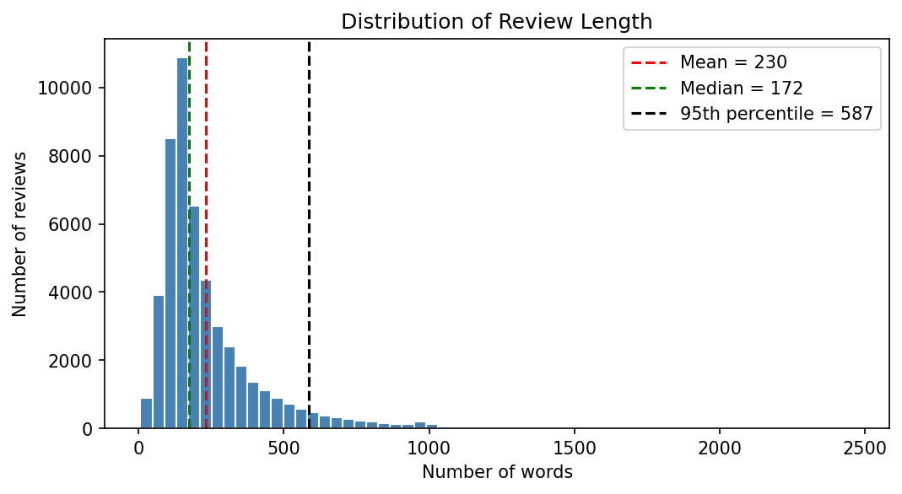
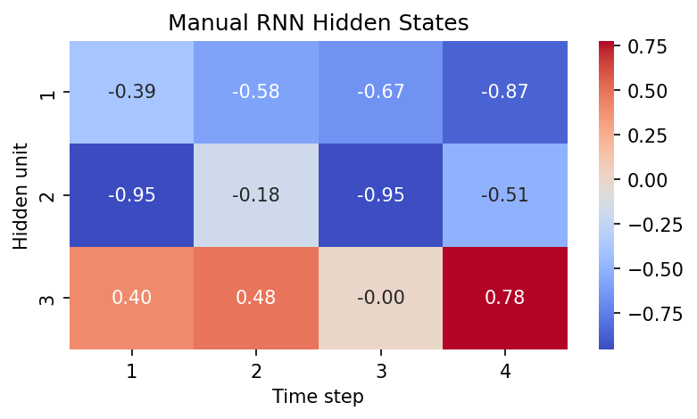
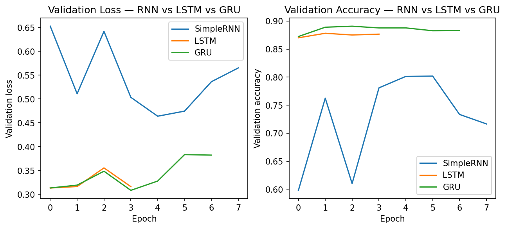
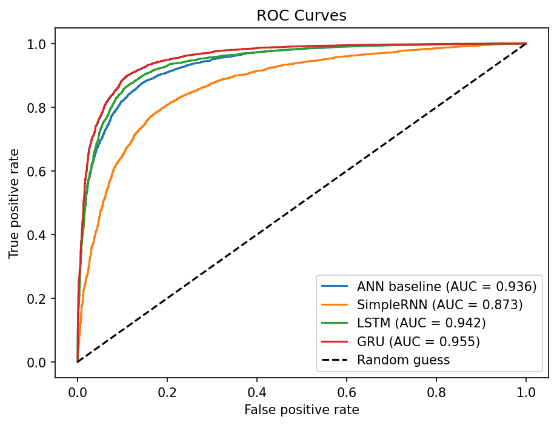
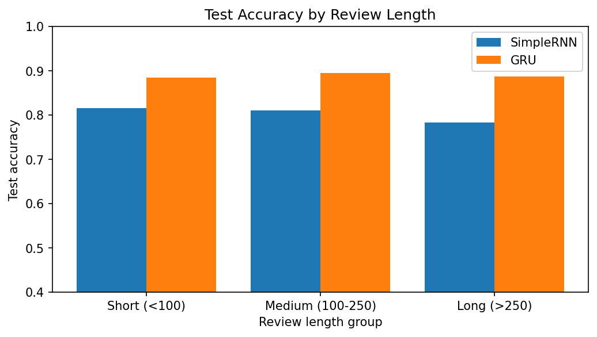
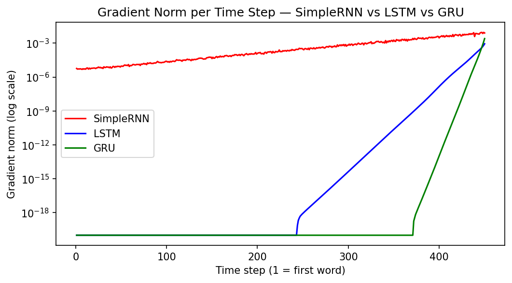

<div align="center">
<br>


<br>

[](#)
[](#)
[](https://www.kaggle.com/datasets/lakshmi25npathi/imdb-dataset-of-50k-movie-reviews)
[](#-results-summary)

<br>


</div>

<br>

## 🎬 Video Walkthrough

<div align="center">

[](#)


🎥 **A complete video explanation (face + screen, 5–10 min)** covering the complete project workflow, including text preprocessing, why word order matters, RNN architecture and manual NumPy forward pass, RNN sequence types, BPTT, vanishing vs. exploding gradients, LSTM gates, GRU gates, model comparison, final recommendation, and live `predict_sentiment()` inference.


> 📌 *Click the button above or [open the video directly →]()*

</div>

---

## 🎯 About This Project

> "Not good" and "good, not bad" use almost the same words but mean opposite things. A model that ignores word order cannot tell them apart — a model that reads text one word at a time can.

This project builds a movie-review sentiment classifier on **49,582 real IMDB reviews** (after removing duplicates) and uses it to answer one question: **why do recurrent networks behave the way they do?** It starts with an order-blind ANN baseline, builds an RNN cell by hand in NumPy, measures what happens to gradients through time, and then compares **SimpleRNN, LSTM, Stacked LSTM and GRU** under an identical training setup.

<div align="center">

```
░░░░░░░░░░░░░░░░░░░░░░░░░░░░░░░░░░░░░░░░░░░░░░░░░░░░░░░░░░░
   50,000 Raw Reviews → Clean → Tokenise → Pad (450 words)
   ───────────────────────────────────────────────────────
   ANN baseline → SimpleRNN → LSTM → Stacked LSTM → GRU
   ───────────────────────────────────────────────────────
   Manual Forward Pass → BPTT → Gradient Norms → Comparison
░░░░░░░░░░░░░░░░░░░░░░░░░░░░░░░░░░░░░░░░░░░░░░░░░░░░░░░░░░░
```

</div>

<br>

---

## 📚 Dataset

| Item | Detail |
|:---|:---|
| **Name** | IMDB Dataset of 50K Movie Reviews |
| **Kaggle** | [lakshmi25npathi/imdb-dataset-of-50k-movie-reviews](https://www.kaggle.com/datasets/lakshmi25npathi/imdb-dataset-of-50k-movie-reviews) |
| **File** | `IMDB Dataset.csv` (columns: `review`, `sentiment`) |
| **Size** | 50,000 reviews (25,000 positive, 25,000 negative) — **49,582** after removing 418 duplicates |
| **Split** | 39,665 train / 9,917 test (80/20, stratified, `random_state=42`) |
| **Known issues** | HTML tags (`<br />`), mixed case and punctuation, duplicate reviews |
| **Licence** | Free for research and educational use |

**Citation**

> Maas, A. L., Daly, R. E., Pham, P. T., Huang, D., Ng, A. Y., & Potts, C. (2011). *Learning Word Vectors for Sentiment Analysis.* Proceedings of the 49th Annual Meeting of the Association for Computational Linguistics (ACL 2011). Stanford AI Lab.

> ⚠️ The CSV is **not** included in this repository. Download it from the Kaggle link and place it next to the notebook. `keras.datasets.imdb` is deliberately **not** used, because cleaning, tokenising and padding the raw text is part of the project.

<br>

---

## ✨ What Makes This Project Stand Out

<table>
<tr>
<td width="50%" valign="top">

### 🧼 Leakage-Free Text Pipeline
- 418 duplicates removed **before** the split
- Split done **before** the tokenizer is fitted; tokenizer fitted on training text only
- Stop-words kept and apostrophes preserved on purpose
- Pre-padding so the last hidden state is built from real words

</td>
<td width="50%" valign="top">

### 🧮 Built by Hand, Then Verified
- A single RNN cell written in plain NumPy (hidden size 3, 4 time steps)
- Output matched Keras `SimpleRNN` — `np.allclose` returned **True**
- A manual LSTM step showing `f`, `i`, `o`, `C(t)` and `h(t)`
- Parameter formulas matched `model.summary()` for RNN, LSTM and GRU

</td>
</tr>
<tr>
<td width="50%" valign="top">

### 📉 Gradient Flow, Measured
- Per-time-step gradient norm measured with `tf.GradientTape`
- SimpleRNN vs LSTM vs GRU on one log-scale plot
- Exploding-gradient demo with and without `clipnorm`
- SimpleRNN accuracy vs sequence length (50 / 100 / 200 / 300)

</td>
<td width="50%" valign="top">

### 🔍 Honest Reporting
- Same optimiser, batch size and EarlyStopping for every model
- Results reported as measured, including surprises: the **ANN baseline beat the SimpleRNN**, and clipping did not help in the demo run
- Limitations of the gradient experiment stated openly (see below)

</td>
</tr>
</table>

<br>

---

## 🗺️ Full Project Journey

<div align="center">

| Task | Focus | Key Output |
|:---:|:---|:---|
| 🧹 **Task 1** | Text cleaning, tokenisation, padding | Duplicate removal · `clean_text()` · length analysis · top-10 words · padded arrays |
| 🧠 **Task 2** | RNN intuition & forward propagation | ANN baseline · manual NumPy RNN · Keras `allclose` check · parameter formula · RNN vs ANN table |
| 🔁 **Task 3** | Types of RNN & SimpleRNN | Four RNN types with shapes · SimpleRNN sentiment model · embedding vectors |
| 📉 **Task 4** | BPTT & gradient problems | Gradient-norm plot · accuracy vs length · exploding-gradient demo with clipping |
| 🔐 **Task 5** | LSTM | Gate equations · 4× parameter check · manual LSTM step · gradient comparison · Stacked LSTM |
| ⚡ **Task 6** | GRU | Update/reset gates · `reset_after` parameter check · 3-way gradient plot · hidden-unit study |
| 🏁 **Task 7** | Final comparison & inference | Results table · ROC · length robustness · error analysis · `predict_sentiment()` · recommendation |

</div>

<br>

---

## 🧼 Preprocessing Summary

| Step | What was done | Why |
|:---|:---|:---|
| 1. Remove duplicates | 418 duplicates dropped (50,000 → 49,582) before splitting | The same review must not appear in both train and test (data leakage) |
| 2. Clean text | Lowercase, strip HTML tags, keep letters and apostrophes, collapse spaces | Removes noise but keeps `don't`, `can't` as meaningful words |
| 3. Keep stop-words | No stop-word removal | `not` and `no` flip the sentiment; word order matters |
| 4. Split | 80/20, `stratify=y`, `random_state=42` (positive share 0.502 in both sets) | Same class balance in train and test |
| 5. Tokenise | `Tokenizer(num_words=10000, oov_token='<OOV>')`, fitted on **train only** | Rare words add noise; `<OOV>` handles unseen words |
| 6. Pad / truncate | `MAXLEN = 450` (≈ 90th percentile), `padding='pre'`, `truncating='pre'` | Fixed length; real words sit at the end for the final hidden state |

Final shapes: `x_train (39665, 450)`, `x_test (9917, 450)`.

<div align="center">



*Review length is right-skewed: mean ≈ 230 words, median 172, longest review 2,462 words — so the padding length is taken from a percentile, not the maximum.*

</div>

<br>

---

## 🧠 RNN, LSTM and GRU in One Paragraph Each

### 🔁 RNN
An RNN reads one word at a time and keeps a hidden state `h(t) = tanh(Wxh·x(t) + Whh·h(t-1) + b)` that summarises everything read so far. The **same weights** are reused at every time step, so the recurrent parameter count (`units × (embedding_dim + units + 1)` = **6,208** for 64 units) does not depend on review length — unlike the ANN baseline, whose size grows with `MAXLEN`. During training the gradient must travel back through every step as a product of many terms, which makes long-range learning difficult.

<div align="center">



*Hidden states from the manual NumPy forward pass (hidden size 3, 4 steps). The result matched Keras `SimpleRNN` exactly.*

</div>

### 🔐 LSTM
The LSTM adds a **cell state** `C(t)` — a protected memory path — controlled by three gates: **forget** (what to drop), **input** (what to write) and **output** (what to reveal). Because `C(t) = f(t)·C(t-1) + i(t)·g(t)`, the memory is updated by gated addition instead of repeated matrix multiplication. It has four weight sets, so exactly **4×** the recurrent parameters of a SimpleRNN (**24,832** — verified in the notebook).

### ⚡ GRU
The GRU is a simplified gated cell with **two gates** (update and reset) and **no separate cell state**. The update gate merges the LSTM's forget and input gates: `h(t) = (1 − z(t))·h(t-1) + z(t)·h̃(t)`. With three weight sets and Keras' default `reset_after=True` it has **18,816** recurrent parameters — about **76%** of the LSTM's — and in this project it was also the most accurate model.

<br>

---

## 🏋️ Training Curves

<div align="center">



*Validation loss and accuracy under the identical setup (Adam lr = 0.001, batch size 64, EarlyStopping with patience 3).*

</div>

- **SimpleRNN** was unstable: validation accuracy jumped between 0.60 and 0.80 across epochs, and training stopped after 8 epochs (best validation loss at epoch 5).
- **LSTM and GRU** started near 0.87 validation accuracy from epoch 1 and moved smoothly. Both began overfitting after only a few epochs, so EarlyStopping stopped them after 4 (LSTM) and 7 (GRU) epochs.
- The **ANN baseline** reached 100% training accuracy within 5 epochs while its validation loss rose from 0.28 to 0.61 — a clear sign of overfitting.

<br>

---

## 📈 Results Summary

<div align="center">

| Model | Parameters | Time / Epoch (s) | Epochs | Test Accuracy | Precision | Recall | F1 | ROC-AUC |
|:---|:---:|:---:|:---:|:---:|:---:|:---:|:---:|:---:|
| ANN baseline | 1,241,729 | ≈ 7 | 5 | 0.8643 | 0.87 | 0.85 | 0.86 | 0.9365 |
| SimpleRNN | 326,273 | 51.5 | 8 | 0.8038 | 0.82 | 0.77 | 0.80 | 0.8725 |
| LSTM | 344,897 | 120.1 | 4 | 0.8731 | 0.90 | 0.84 | 0.87 | 0.9422 |
| Stacked LSTM | 357,281 | 172.6 | 7 | 0.8903 | 0.90 | 0.88 | 0.89 | 0.9525 |
| **GRU** | **338,881** | ≈ 116 | 7 | **0.8911** | **0.90** | **0.88** | **0.89** | **0.9551** |

*Precision, recall and F1 are for the positive class (from `classification_report`, 2 decimals). "≈" times are taken from the Keras training logs. Test set: 9,917 reviews.*

</div>

**What the table shows**
- **GRU ranks first** on accuracy, F1 and ROC-AUC, with fewer parameters than the LSTM and Stacked LSTM. Its lead over the Stacked LSTM is only 0.0008 accuracy, which is within what one training run can vary by.
- **GRU beat LSTM by about 1.8 points** of accuracy (0.8911 vs 0.8731) at similar time per epoch.
- **Stacking added cost for a gain over LSTM** (+1.7 points) but ran ≈ 44% slower per epoch than the single LSTM and no better than the GRU.
- **The SimpleRNN was the weakest model**, and the order-blind ANN baseline beat it (0.8643 vs 0.8038), although the ANN overfits heavily and has more than 3× the parameters.

### ROC Curves and Length Robustness

<div align="center">
<table>
<tr>
<td align="center" width="50%">



*ROC shows class separation at every threshold, not just 0.5.*

</td>
<td align="center" width="50%">



*Accuracy on short (<100), medium (100–250) and long (>250 words) reviews.*

</td>
</tr>
</table>
</div>

<br>

---

## 🔬 Key Experiments

### 📉 Gradient Norm per Time Step

<div align="center">



*Gradient norm per time step (log scale), measured on one batch of 64 reviews with untrained models.*

</div>

The loss uses only the last hidden state, so the gradient is measured with respect to the **embedding output at each time step** — it shows how much of the learning signal reaches each word.

| What was measured | Result |
|:---|:---|
| SimpleRNN, first word | gradient norm ≈ 5.7 × 10⁻⁶ |
| SimpleRNN, last word | gradient norm ≈ 7.9 × 10⁻³ |
| SimpleRNN, last ÷ first | ≈ **1,379×** weaker at the start of the review |

**Reading the plot honestly**
- The SimpleRNN gradient decays steadily toward the early words — about three orders of magnitude over 450 steps — which is the vanishing-gradient effect.
- The LSTM and GRU curves sit at the plot floor (10⁻²⁰) for the first ≈ 245 (LSTM) and ≈ 370 (GRU) steps, meaning the gradient there is effectively **zero**, and they only rise over the last part of the review. Most likely this is float32 underflow: with 450 steps and untrained gates, the repeated multiplication goes below the smallest representable number.
- So at **initialisation, with `MAXLEN = 450`**, this experiment does **not** show the gated cells carrying gradient further back than the SimpleRNN. The LSTM and GRU advantage in this project is visible in the trained results (accuracy, F1, ROC-AUC, smooth curves), not in this plot.
- To test the gating explanation directly, the gradient measurement should be repeated on **trained** models or with a shorter sequence length.

### 📏 SimpleRNN Accuracy vs Sequence Length

| Padding length | 50 | 100 | 200 | 300 |
|:---|:---:|:---:|:---:|:---:|
| Test accuracy | 0.7502 | 0.7344 | 0.8134 | 0.8344 |

In this run SimpleRNN accuracy **rose** with length instead of falling. Because the SimpleRNN training curves are very unstable (see above) and each length was trained once for 8 epochs, differences of a few points should not be over-interpreted.

### 💥 Exploding Gradient Demo (Adam lr = 0.05)

| Epoch | 1 | 2 | 3 | 4 | 5 |
|:---|:---:|:---:|:---:|:---:|:---:|
| Loss, no clipping | 0.702 | 0.650 | 0.629 | 0.622 | 0.613 |
| Loss, `clipnorm=1.0` | 0.713 | 0.696 | 0.677 | 0.667 | 0.654 |

No NaN or loss spikes appeared at this learning rate, so a true explosion was **not** reproduced, and clipping did not improve the loss. The demo shows clipping working as designed (it limits the update size and slowed learning slightly), but a stronger setting such as SGD with lr = 1.0 would be needed to trigger an explosion.

<br>

---

## 🏆 Which Recurrent Cell Should We Use?

<div align="center">

<table>
<tr>
<td align="center" width="25%">

### 🔁 SimpleRNN
**Lightest, least reliable**
<br><br>
80.4% accuracy with unstable training; beaten even by the ANN baseline.
<br><br>
**For learning, not production**

</td>
<td align="center" width="25%">

### 🔐 LSTM
**Solid, overfits early**
<br><br>
87.3% accuracy; best validation loss came in epoch 1, so EarlyStopping stopped it after 4 epochs.
<br><br>
**Good, but GRU beat it here**

</td>
<td align="center" width="25%">

### ⚡ GRU
**Best balance**
<br><br>
89.1% accuracy, F1 0.89, ROC-AUC 0.955 with fewer parameters than LSTM and Stacked LSTM.
<br><br>
**Recommended**

</td>
<td align="center" width="25%">

### 🧱 Stacked LSTM
**Accurate, but costly**
<br><br>
89.0% accuracy — on par with GRU — but 357K parameters and ≈ 173 s per epoch.
<br><br>
**Not worth the extra cost**

</td>
</tr>
</table>

</div>

**Recommendation for a production sentiment service:** use the **GRU**. It had the best accuracy, F1 and ROC-AUC, trained about as fast as the single LSTM, and needed fewer parameters than either LSTM variant. The Stacked LSTM matched its accuracy only at a higher cost.

**Limitations (observations only):**
- No pretrained knowledge — embeddings are learned from scratch, so sarcasm and rare words are handled weakly.
- One-directional reading — the model reads left to right only and cannot use later words to understand earlier ones.
- Single training run per model, so small differences (for example GRU vs Stacked LSTM) are not conclusive.

<br>

---

## 🧪 What This Project Covers (Theory)

<details>
<summary><b>📖 Click to expand — Deep Learning Concepts Covered</b></summary>
<br>

- Why text is sequential data and why a bag-of-words / order-blind model fails on negation
- Why duplicates must be removed before splitting (data leakage)
- Why stop-words are kept and apostrophes preserved for sequence models
- Why the tokenizer is fitted on training text only, and what the `<OOV>` token does
- Why pre-padding suits RNNs that read the last time step
- The RNN equation, hidden state and weight sharing across time
- The four RNN types (one-to-one, one-to-many, many-to-one, many-to-many) and why sentiment analysis is many-to-one
- What the Embedding layer learns and why it is trained from scratch here
- Backpropagation Through Time and why the gradient is a product of many Jacobian terms
- Vanishing vs exploding gradients, and what gradient clipping does and does not fix
- LSTM gates and the cell state as a protected memory path
- GRU update and reset gates, and how GRU differs from LSTM
- How to read ROC curves and why accuracy alone is not enough

</details>

<br>

---

## 📁 Repository Structure

```
deep-learning-pr5/
│
├── 📓 DL_PR5.ipynb               ← Full notebook — data to final recommendation
├── 🌐 DL_PR5.html                ← HTML export of the executed notebook
├── 📊 plots/                     ← All saved figures
│   ├── length_distribution.png
│   ├── rnn_forward_heatmap.png
│   ├── gradient_norms_all_cells.png
│   ├── training_curves_rnn_lstm_gru.png
│   ├── roc_curves.png
│   ├── results_table.png
│   ├── results_table.csv
│   └── accuracy_by_length.png
├── 📋 requirements.txt           ← Library list
└── 📖 README.md                  ← This file
```

*Note: `IMDB Dataset.csv` must be downloaded from Kaggle and placed next to the notebook before running it.*

<br>

---

## 📦 Requirements

```
tensorflow
scikit-learn
pandas
numpy
matplotlib
seaborn
```

<br>

---

## 🛠️ Tools Used

| Tool | Used For |
|:---|:---|
| Python 3 / Jupyter Notebook | Development environment |
| TensorFlow 2.x / Keras | Embedding, SimpleRNN, LSTM, GRU, training, `GradientTape` |
| scikit-learn | Train/test split, metrics, ROC curves |
| pandas / NumPy | Data handling, manual RNN and LSTM forward passes |
| Matplotlib / Seaborn | All plots and heatmaps |

<br>

---

## 👨‍💻 Author

<div align="center">

### **Ayush Isamaliya**
*Data Science & Aspiring ML Engineer*

</div>

### 🌐 Connect With Me

<div align="center">

[](https://github.com/your-username)
[](https://www.linkedin.com/in/your-profile/)

</div>

<br>

<div align="center">


**Built as part of the Deep Learning track at Red & White Skill Education**


*Made with ❤️ | Deep Learning PR-5 | Sentiment Analysis with RNN + LSTM + GRU | Gradient Flow Analysis*

</div>
